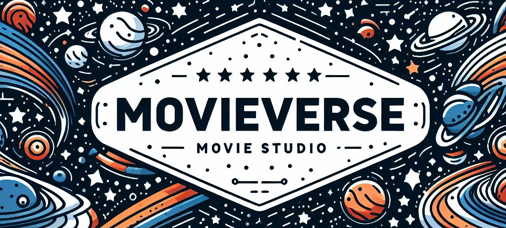
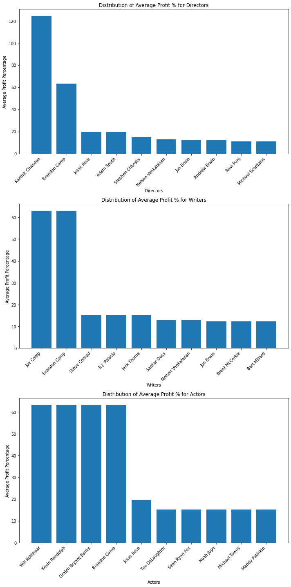

# Overview

We are a team of Data Scientists hired to produce three or more actionable reccomendations which will guide your company in their new venture: opening a movie studio to produce films.

# References and Links 

- [Presentation](https://github.com/nechamab/phase-2-project/blob/main/Presentation.pdf)
- [Exploratory_Notebook](https://github.com/nechamab/phase-2-project/blob/main/notebooks/exploratory.ipynb)
- [Final_Notebook](https://github.com/nechamab/phase-2-project/blob/main/notebooks/final.ipynb)

# Business Problem

From our understanding, your entry into this industry is primarily motivated by revenue rather than an urge to create art, so our analysis defines success as the ratio of Revenue / Budget for a 
film or segment of the industry. We assume you are looking to accumulate revenue rather than win awards or garner high ratings for your efforts. As such, we sought to answer questions such
as: what types movies tend to be most profitable based on movie genre, runtime, and release month. Are there certain actors, directors, or writers who are commonly attached to successful projects?
Do production budgets significantly affect profits, or does it make more sense to focus on revenues?

# Data Understanding and Analysis

This project utilizes python for exploratory data analysis and python along with SQL for interacting with the data in the databases. These are publicly available databases and datasets hosted on IMDB.com, Box Office Mojo, The Movie Database, The Numbers, and Rotten Tomatoes. Box Office Mojo and The Numbers datasets are .csv files, while the IMDB data is stored is a SQL-friendly database.
The majority of our useful data encompasses the years 2010 to 2018, or 2010 to 2021 in some cases. These data sets and databases contain wide-ranging information on movie finances, audience review
scores, production details including relevant directors and actors, and more. By combining data from different sources we were able to extract information which led us to the following conclusions:

>Highest average percentages in profit had movie genre that included “Family” in their category. 

----

>Average Production Budget: Approximately $65 million for family films

>Peak profitable months for the family category shown to be around  spring break period, early summer and holiday period of the year.

>Mid tier for profits June & July.

----
 

>Brandon Camp and Nelson Venkatesan among the highest profit percentages for both directors and writers category. 

>Top actor profit percentages over 60%.

>Brandon Camp also included in the highest profit percentage for Actors. 

----

>Average Movie Runtime: Approximately 100 mins - 1 hour 40 mins

>Highest grossing films fall within mean range times. 

----

# Conclusion

In conclusion, we recommend that:
> You focus your early efforts on making a film or films in the Family genre. We also see highly profitable films in other genres such as Thriller, Crime, and Fantasy, but Family films
        appear to be the most profitable overall.
> You tailor your release date to fit your film's desired market positioning: holiday season (Nov and December) sees increased demand from moviegoers but also increased competition from 
        other movie studios for moviegoer attention.
> You pursue one or more of the actors, writers, or directors whose work is correlated with above-average success in the Family genre. Specifically, Brandon Camp is a writer/director/actor
        whose films return above-average gross revenue to budget ratios.
> Runtime for your first movie should be around 1hr 40min
> Your production budget should be approximately $65m

# Contact Information

Reach out to us on Discord!

- Ron: rizzy.ronnie
- Nechama: nechama_
- Ryan: rtonetwotree